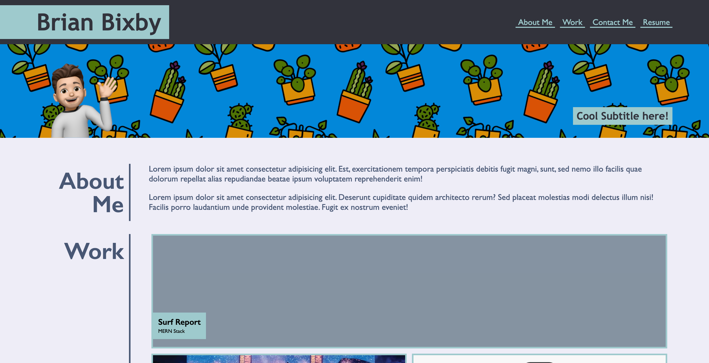

# HMWK2 - (02 Advanced CSS: Portfolio)

## Description

This project is a portfolio that I created from scratch. My task was to create the site using skills I've recently learned: flexbox, media queries, and CSS variables.

## Screen shot

The following image shows the web application's appearance and functionality:

## Link

[Live site](https://brianbixby.github.io/hmwk2/)

## Technology

- [CSS](https://developer.mozilla.org/en-US/docs/Web/CSS)
- [HTML](https://developer.mozilla.org/en-US/docs/Web/HTML)
- [Github](https://github.com/brianbixby/hmwk2)
